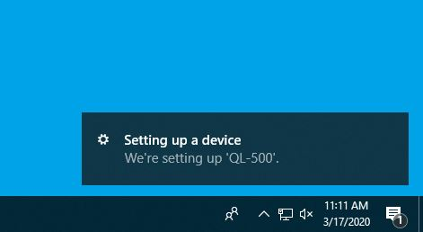
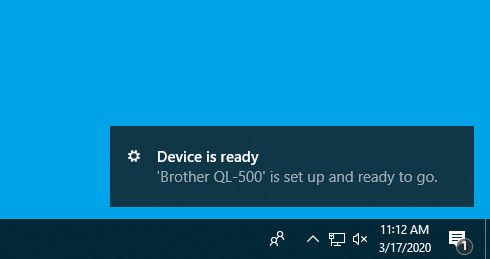
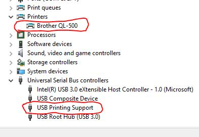
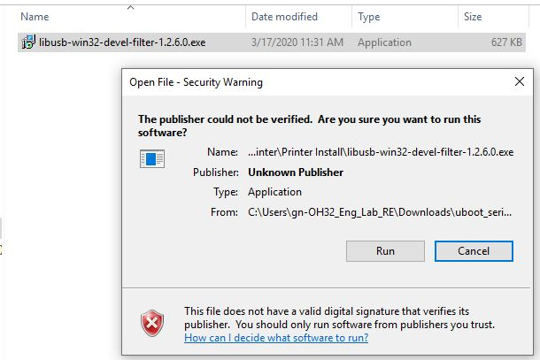
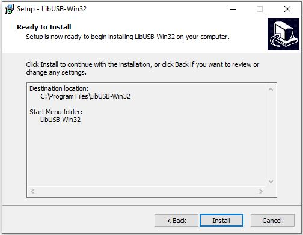
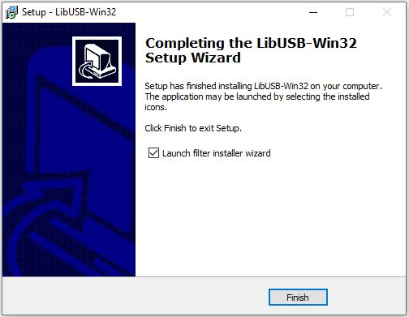
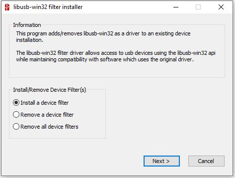
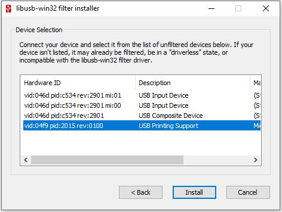
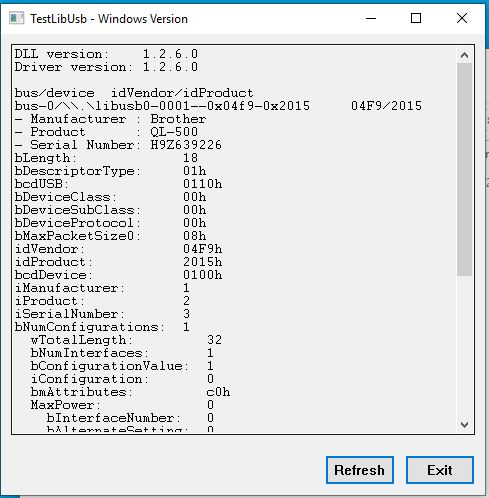

# Installing the Brother QL-500 Label Printer Driver

In order to use the Brother QL-500 label printer with the programming GUI, a USB driver is required and must be compatible with the _libusb0.dll_ library.
This driver is different than the one that is installed by plug-n-play or from the Brother driver installation CD.
The reason this is necessary is so that Python can access the printer through its scripts. 
In order to do so, the script must have a special API to communicate with the printer over USB. This API is called _PyUSB_.
The GUI executable contains the API pre-packaged, however the API must make use of a C-library called _libusb0.dll_, and in order for the library to have access to the hardware, a special driver must be installed.
This driver, and all the links to the libusb0 library will be setup through a tool called a **filter wizard** which you will install now.

## Step 1: Plug in the Brother QL-500 and install the plug-n-play driver

Plug the Brother QL-500 printer into an outlet and plug the USB cable into the computer.
Press the power button on the printer.
You should see your computer attempting to install the plug-n-play drivers.

Once the plug-n-play drivers have been installed, the computer should recognize the QL-500 device.

You can check your **Device Manager** to verify that the device is recognized as a printer and that the print support service is recognized as a USB interface.

## Step 2: Install LibUSB-Win32

With the printer plugged in and turned on, you will now install the LibUSB-Win32 application.
In the project folder structure, navigate to the **Printer Install** directory and double-click ***libusb-win32-devel-filter-1.2.6.0.exe***.

Click **Run** and follow the setup instructions to install the application on your computer.

Click **Install**.

Once the installation completes, you have the option to launch the filter wizard immediately. Do so now, or find it in the Start Menu.

Click **Finish**.

## Step 3: Create a filter for the QL-500 printer

Once you launch the filter wizard, you will see the following screen:

Choose the option _Install a device filter_ and click **Next**.
From the list of devices, search for a devices whose vendor ID matches _0x04F9_ (Brother USA) and whose description is _USB Printing Support_ then click **Install**.

The filter will now be installed on your computer, and the API should now have access to the printer through the USB interface.

## Step 4: Test the filter

To test if the API will be able to communicate with the printer, you can run the tool _Test (Win) Program_ from the Start Menu under _LibUSB-Win32_.

If the printer's USB information is shown in the window, then the API has successfully communicated with the printer and the GUI should be able to print labels.
If there is nothing in the resulting window, then the API is not able to communicate with the printer. You should check all connections, power, and driver installations.
If you necessary, repeat the driver installation procedure.

**This procedure was tested on Windows 10 64-bit operating systems.**
