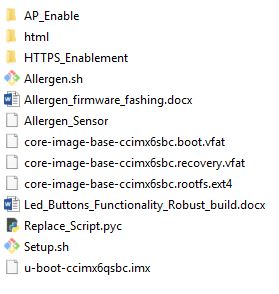
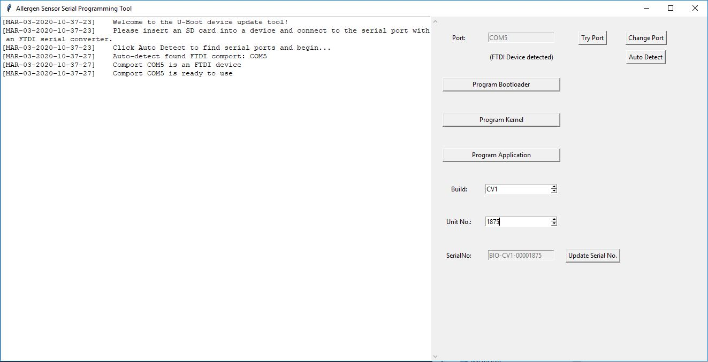
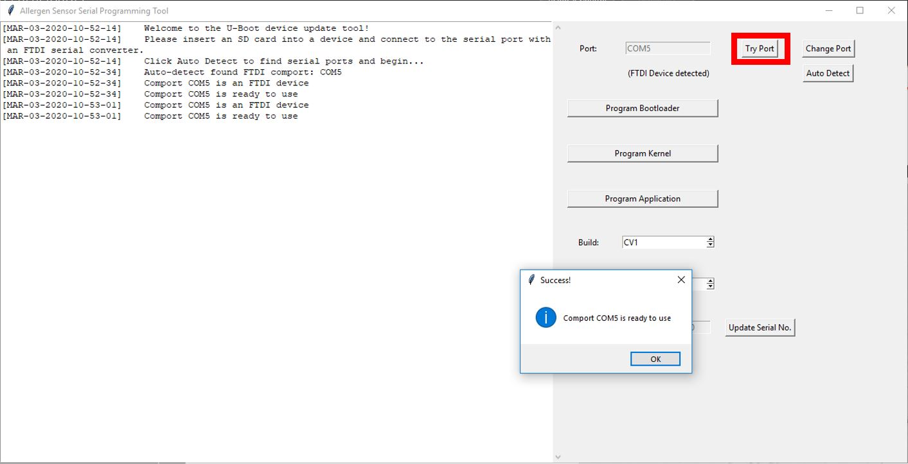
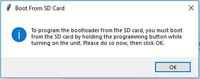
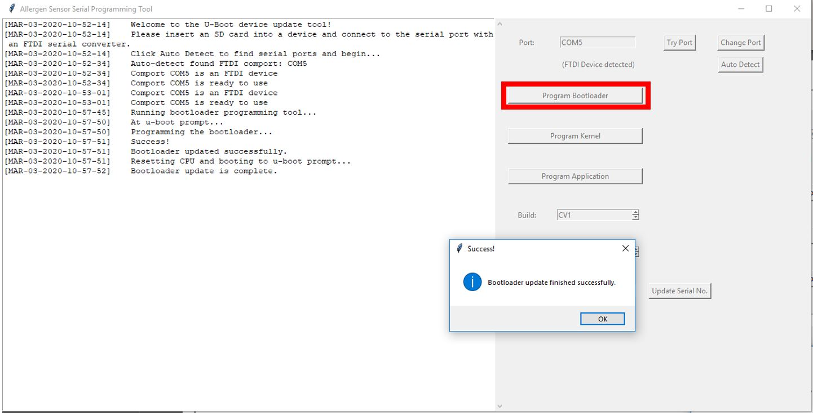
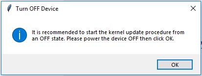
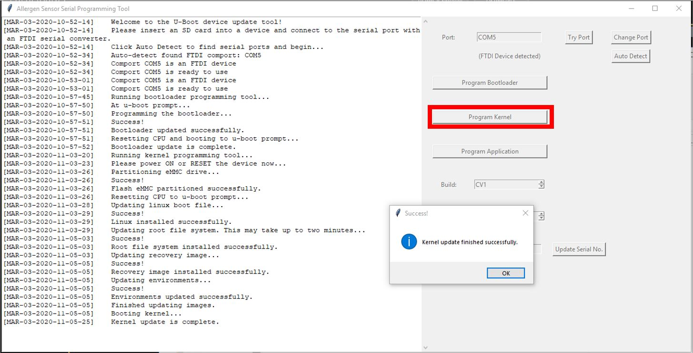
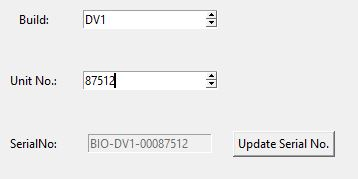
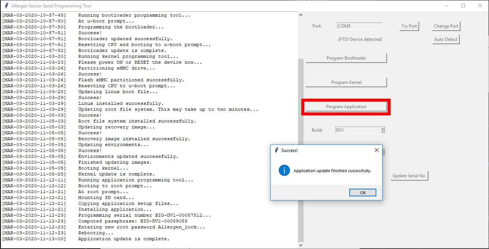
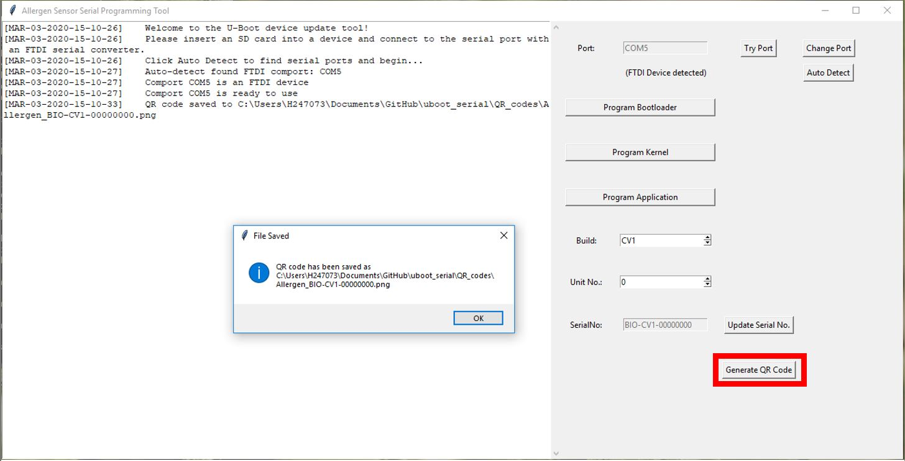

# Programming tool for updating devices with U-Boot via SD card and serial port

This tool will automatically install uboot images, kernel images, and application images for the device.
This tool is specific to a device and may not be used for other uboot devices.

For any questions, contact the author: steven.lowery@honeywell.com

# Getting Started

Run the program by navigating to _uboot_serial/dist/uboot_gui.exe_

# Setup

This program was created to flash new firmware onto the Allergen Sensing device.
It follows the instruction document given in [docs/Allergen_firmware_flashing.pdf](docs/Allergen_firmware_flashing.pdf).


This program contains three command line tools for programming the bootloader, Yocto kernel, and application to the device.
The program also contains a GUI which uses these command line tools in a simple user interface.
The program communicates with the device via a serial connection, so a USB-to-serial converter is required.
The images and application files must be stored on an SD card which is inserted into the device.
**The program does not load the firmware from the computer to the device, it simply points to firmware images on the SD card.**

### Basic Setup

The components you will need for this setup are as follows:
1. Formatted, bootable, SD card with firmware images
2. USB-to-serial converter (ideally FTDI)
3. Programming cable (connector with wires to interface between device and FTDI cable)
4. Allergen sensing device
5. Small object for pressing the programming button (paper clip, pen, etc.)


You will first need access to the programming port, SD card slot, and programming button on the device.
To access these ports, you will need to remove the lower rubber bumper from the device.


Second, you will need to have the SD card properly formatted.
The easiest way to accomplish this is to acquire a cloned image from the firmware developers and simply flash this image to your card.
After flashing the image to your card, you will have a bootable and formatted card with a separate storage partition. 
You can simply copy new files to the storage partition via a microSD card converter and plugging it into your computer. 
A good flashing tool to use on Windows is [Balena Etcher](https://www.balena.io/etcher/). 


### Serial Port Access

To connect to the device, plug the programming cable into the programming port, then wire the programming cable to the USB-to-serial converter properly making note of TX, RX, and GND connections.
One way to verify that the port is working is to use [PuTTY](https://putty.org/) and open the serial port with **115200-8-N-1** settings and power on the device.
If all is working properly, you should see a U-Boot message on the terminal followed by boot script output. 

### Python or Portable EXE Setup

Python is not required to use the GUI.
A Python environment, complete with interpreter and all necessary modules, libraries, and packages, is self-contained in the portable executable. 
The command line tools require a Python installation.
For those familiar with Python, the installation is described in the sections to follow. 
For those unfamiliar with Python, please follow these steps to install or verify your Python installation and environment:
1. (OPTIONAL - for command line use) It is recommended to install Python via a package and environment manager, the most common of which is called Anaconda.
- Download and install the Python 3.7 version of Anaconda using the graphical installer for your system [here](https://www.anaconda.com/distribution/#download-section).
- During installation it is important to **include Python in your PATH environment variable** even though the setup does not recommend this.
- Test your Python and Conda installations by opening up a command prompt terminal and typing `python --version` and `conda --version` to check if your environments are discoverable via PATH.
- If you get an error when typing `python` or `conda` in command prompt, it is most likely because Python was not installed to the PATH for the user. 
You will need to add Python/Anaconda to PATH or re-install Python/Anaconda.
2. (OPTIONAL - for command line use) It is recommended to create a virtual environment to run an application in.
- Use `conda create -n ubootgui_py37 python=3.7` from a command line terminal to create the environment.
- Type `activate ubootgui_py37` to activate the environment
3. (OPTIONAL - for command line use) Install the necessary packages to your environment following the installation instructions below.
4. (OPTIONAL - for command line use) To run a specific tool, navigate to the project directory under the `uboot_serial` folder and run a script by typing `python` followed by the script name.
- To run the GUI from command line, type `python uboot_gui.py`
- To get the help file (commonly referred to as the _man page_), use the `-h | --help` option by typing, for example, `python update_bootloader.py -h`

To run the program GUI without installing Python, simply run the program by navigating to _uboot_serial/dist/uboot_gui.exe_.

### Label Printer Setup

To use the label printer functionality, you will need to install a custom driver for the printer. Please follow the instructions in the _Printer Install_ directory.

# Installation

No installation is required to run the GUI.
The GUI has a feature for creating QR codes which requires the qrcode package.
The GUI also has a feature for printing QR labels with a Brother QL-500 label printer, which requires a separate driver installation described in the _Printer Install_ directory.
A portable Windows executable is available for machines without Python installations. 
For using the Python command line tools, the following installations are necessary:
```
pip install -r requirements.txt
```
or
```
pip install pyserial
pip install qrcode[pil]
pip install brother_ql
```

### GUI
Due to certain string formatting techniques, Python 3.6.10 or greater is required.
It is suggested to use a virtualenv or conda environment and install Python 3.7 as follows:
```
conda create -n ubootgui_py37 python=3.7
activate ubootgui_py37
pip install -r requirements.txt
```

### Portable Windows EXE
If you do not wish to install Python on your machine, there is a portable windows *.exe distribution.
To download the package, choose _Download as Zip_ from GitHub rather than cloning the repository,
and navigate to the `./uboot_serial/dist` folder. The `dist` folder can be zipped into a portable self-contained Python runtime with all required packages and libraries.
Everything needed to run the GUI application is contained in the `dist` folder. 
To run the portable executable on a Windows machine, navigate to and run `./uboot_serial/dist/uboot_gui.exe`.

### Printer Installation

There is a separate instruction manual for installing the Brother QL-500 label printer. Please follow instructions in the _Printer Install_ directory.

# Dependencies

### Command Line

Tested with Python>=3.4.0

`pyserial`

### GUI

Python>=3.6.10

`pyserial`

`qrcode[pil]`


# Usage

There are three tools in this package: one for updating the bootloader firmware, another for updating the Yocto kernel firmware, and a third for updating application software.

If the device is brand new out-of-box, an initial bootloader installation requires booting from the SD card.
To boot from the SD card, the programming button must be held while powering on the device.
After programming the initial bootloader, further bootloader updates do not generally require booting from the SD card, though it is always recommended.

It is always recommended to do a hard power-on-reset (POR) between each installation, though it is not required so long as the device did not boot from SD card.

In general, the procedure should be as follows:
1. SD card is inserted
2. Boot from SD card by holding the programming button while powering on.
3. Install the bootloader from SD card using `python update_bootloader.py`
4. Power on reset
5. Install the Yocto kernel images using `python update_kernel.py`
6. Power on reset
7. Install the application using `python update_application.py SERIALNO`

For a device that is already programmed and simply needs updating, the procedure may be as follows:
1. SD card is inserted
2. Power on the device
3. Install the necessary base updates (bootloader or kernel) with `python update_bootloader.py` or `python update_kernel.py`
4. Install the new application (no POR required) with `python update_application.py SERIALNO`

For a device that simply needs an application update from the SD card, the procedure is simple:
1. SD card is inserted
2. Power on the device
3. Update the application with `python update_application.py SERIALNO`

### SD Card Contents

All the tools have fields with default values for image file names that can be overridden if necessary. The following default values are assumed:

> root password = "Allergen_lock"

> u-boot image filename = "u-boot-ccimx6qsbc.imx"

> boot file image filename = "core-image-base-ccimx6sbc.boot.vfat"

> root file system image filename = "core-image-base-ccimx6sbc.rootfs.ext4"

> recovery image filename = "core-image-base-ccimx6sbc.recovery.vfat"

The micro SD card should be FAT formatted and flashed with the U-Boot image in a separate BOOT partition and the other image files in a separate partition.
If all default filenames are used, the SD card contents should be as follows:



### Python

#### Bootloader
```python
import uboot
from update_bootloader import update_bootloader

# print the docs
print(update_bootloader.__doc__)

# update bootloader
port = "COM5"
image = "u-boot-ccimx6qsbc.imx"
update_bootloader(port, image)
```

#### Kernel
```python
import uboot
from update_kernel import update_kernel

# print the docs
print(update_kernel.__doc__)

# update kernel
port = "COM5"
firmware = {"boot_image": "core-image-base-ccimx6sbc.boot.vfat", 
			"rootfs_image": "core-image-base-ccimx6sbc.rootfs.ext4", 
			"recovery_image": "core-image-base-ccimx6sbc.recovery.vfat"}
update_kernel(port, firmware)
```

#### Application
```python
import uboot
from update_application import update_application

# print the docs
print(update_application.__doc__)

# update application
port = "COM5"
serialno = "BIO-XXX-12345678"
update_application(port, serialno)
```

#### QR Code
```python
import qrcode
img = qrcode.make('Allergen_BIO-CV1-12345678')
img.save("./QR_codes/Allergen_BIO-CV1-12345678.png")
```

### Command Line

#### Programming the Bootloader

```
usage: update_bootloader.py [-h] [--port PORT] [--image IMAGE]

optional arguments:
  -h, --help     show this help message and exit
  --port PORT    The COM port on which the FTDI serial device is connected. On
                 Windows machines, this will be the word COM followed by a
                 port number. By default, this script scans for FTDI devices
                 and selects one if available.
  --image IMAGE  The name of the u-boot image file to be flashed;
                 default=u-boot-ccimx6qsbc.imx
```

#### Programming the Yocto Kernel

```
usage: update_kernel.py [-h] [--port PORT] [--boot_image BOOT_IMAGE]
                        [--rootfs_image ROOTFS_IMAGE]
                        [--recovery_image RECOVERY_IMAGE]

optional arguments:
  -h, --help            show this help message and exit
  --port PORT           The COM port on which the FTDI serial device is
                        connected. On Windows machines, this will be the word
                        COM followed by a port number. By default, this script
                        scans for FTDI devices and selects one if available.
  --boot_image BOOT_IMAGE
                        The name of the boot image file to be flashed;
                        default=core-image-base-ccimx6sbc.boot.vfat
  --rootfs_image ROOTFS_IMAGE
                        The name of the rootfs image file to be flashed;
                        default=core-image-base-ccimx6sbc.rootfs.ext4
  --recovery_image RECOVERY_IMAGE
                        The name of the recovery image file to be flashed;
                        default=core-image-base-ccimx6sbc.recovery.vfat
```

#### Installing the Application 

```
usage: update_application.py [-h] [--port PORT] [--root_psswd ROOT_PSSWD]
                             serialno

positional arguments:
  serialno              The new serial number to be flashed on the device.

optional arguments:
  -h, --help            show this help message and exit
  --port PORT           The COM port on which the FTDI serial device is
                        connected. On Windows machines, this will be the word
                        COM followed by a port number. By default, this script
                        scans for FTDI devices and selects one if available.
  --root_psswd ROOT_PSSWD
                        The new root password if other than the default.
                        default=Allergen_lock
```

#### Generating the QR Code

```
qr "Allergen_BIO-CV1-12345678" > 12345678.png
```

### GUI

#### Introduction to the GUI



#### Serial Port Selection

To select the serial port, click **Auto Detect** to automatically find an FTDI Device.
If you are using a serial converter device that is not recognized as an FTDI device, you can click **Change Port** and manually enter the COM port name (you can find this in the Device Manager).
After entering a port manually, you can click **Try Port** to test if the port is available.



#### Programming the Bootloader

When programming the bootloader, a prompt pops up instructing the user to boot from SD card by holding the programming button and power on the device.
Once the device has been booted from the SD card, the user may click OK and programming will begin.





#### Programming the Yocto Kernel

When programming the kernel, a prompt pops up instructing the user to turn the device off (this is to allow the device to boot from eMMC rather than SD card - if the device was already rebooted after programming the bootloader, then this is unnecessary).
Once the dialog has been acknowledge and the device has booted from eMMC rather than SD card, the programming will begin.
Keeping a watch on the output log, a message indicates that the device must then be turned ON.
After turning on the device, programming begins and a success message is given after it is complete.





#### Setting the Serial Number and Installing the Application

Before programming the application, the serial number must be set. The serial number is automatically compiled into a 16 character value given the model _BIO_, followed by a hypen, then the build level, followed by another hyphen, then the numeric unit number in a field of eight digits.
Both fields, _Build_ and _Unit No._ are both able to be overridden, but the compiled serial number may not be valid and will throw an error during programming.
Requirements for a valid serial number are to be 16 characters, the first 8 must be alpha-numeric and all caps, the last 8 must be all numeric.
To compile the serial number, click the **Update Serial No.** button. 



To program the application, simply click **Program Application**



#### Generating the QR Code

After programming a device, a QR code should be saved and printed to label the unit. Click the **Generate QR Code** button to save the QR code as a PNG. 
The format of contents of the QR code is "Allergen_{SERIALNO}" and the filename is identical to the contents.




